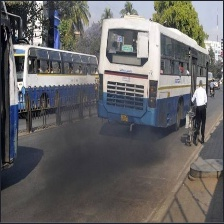
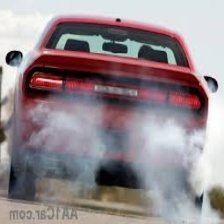
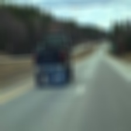
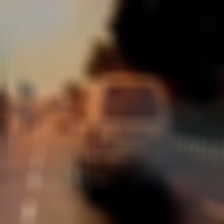
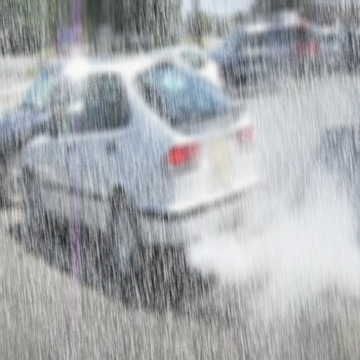
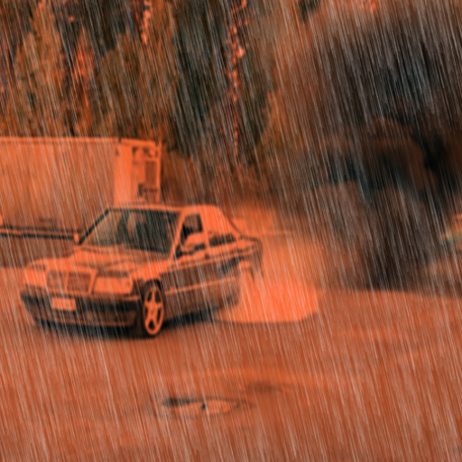
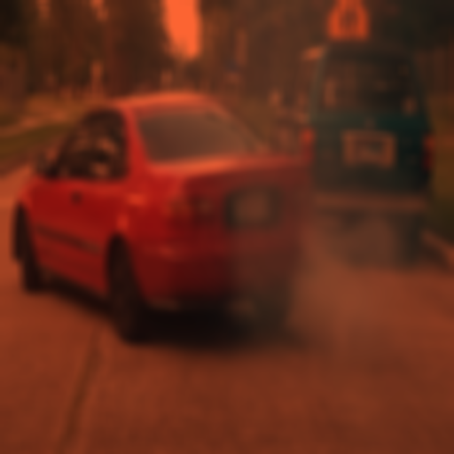

# Dataset 1 description
Data set contains 3000 images including day and night.
Below image augmentations have been used.
1. blur operation with kernel (15x15), 
2. flip operation with mode horizontal
3. rotaion  +15 degree to -15 degree

Image size: 224 x 224
Total 3000 images
1. **WithoutPollution**: 	1775 
2. **WithPollution**: 	    1225

# Sample pollutant vehicle images from Dataset 1
   

# Dataset 2 description
Data set contains 1000 images inclusing day and night.
Below image augmentations have been used.
1. blur operation with kernel (15x15), 
2. flip operation with mode horizontal
3. rotaion  +15 degree to -15 degree
4. Rainy image generation using imgaug library
5. Foggy image generation using imgaug library

Image size: 512 x 512
Total 1000 images
1. **WithoutPollution**: 	500 
2. **WithPollution**: 	    500
	
	
# Sample pollutant vehicle images from Dataset 2
   
	
	
# Citation
Please refer the below paper while using the data set.
